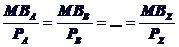
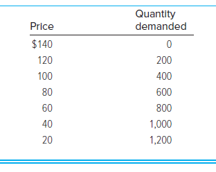
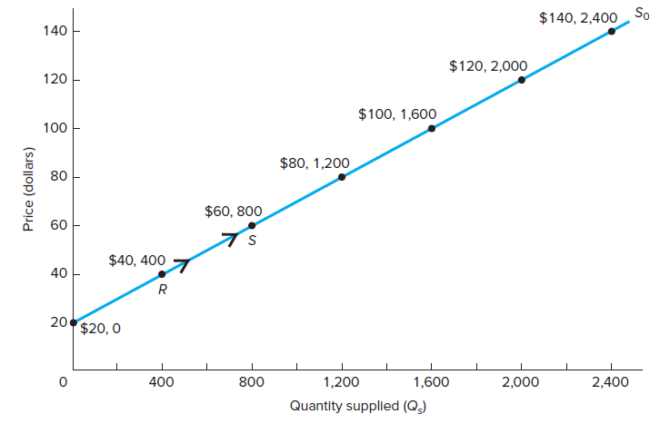

# Presentation: Introduction

## Slide 1

**Text Content:**
- Introduction
- Managers, Profits, and Markets

## Slide 2

**Text Content:**
- Managerial Economics
- Managerial Economics 
Applies microeconomic theory to business problems
Uses economic analysis to make decisions for profit maximization

What is Microeconomics?
Study of consumer behavior, businesses, and markets
Helps us to understand business practices and tactics
Uses marginal analysis to provide the foundation for understanding everyday business decisions and strategy

## Slide 3

**Text Content:**
- Managerial Decision-Making
- Sample Questions that are addressed:
How many units should we produce, and at what price should we sell them?
How many employees should we hire and how should they be compensated?
Five Key Principles of Effective Management:
Identify goals and constraints
Recognize the nature and importance of profits
Understand incentives and markets
Use marginal analysis and time value of money techniques
Make data-driven decisions

## Slide 4

**Text Content:**
- 1. Identify Goals and Constraints
- Profit Maximization
Firm’s overall goal is to maximize economic profit

Constraints
Caused by scarcity
Available technology
Prices of inputs used in production
Time

## Slide 5

**Text Content:**
- 2. Recognize the Importance of Profit
- Role of Profits
Signal to resource holders of where resources are most highly valued by society

Accounting Profit
GAAP rules do not allow deduction of implicit costs (except depreciation)
		Acct Profit = Total Revenue – Explicit costs
Economic Profit
= Total Revenue – Total Economic (or Opportunity) Cost
= Total Revenue – Explicit costs – Implicit costs

## Slide 6

**Text Content:**
- Economic Cost of Resources
- Economic Cost of Using Resources
Opportunity cost (what firm owners give up to use the resource)

Categories of inputs or resources
Market-supplied resources – owned by others and hired or rented (Explicit Costs)
Owner-supplied resources – owned and used by the firm 		(Implicit Costs)
Equity Capital
Firm’s Land or Capital
Time

## Slide 7

**Text Content:**
- Economic Cost of Using Resources

## Slide 8

**Text Content:**
- Porter’s 5 Forces for Long-Run Profit

## Slide 9

**Text Content:**
- 3. Understand Incentives and Markets
- Incentives
Impact how resources and used and how hard employees work

Markets
Arrangement where buyers and sellers exchange goods / services

Market Structure
Characteristics that determine economic environment in which a firm operates
Number and size of firms in market
Degree of product differentiation and likelihood of new firms entering

## Slide 10

**Text Content:**
- Market Structure
- Price-taking firm
Cannot set price of its product
Price determined strictly by market forces of supply and demand

Price-setting firm
Has a degree of market power – ability to raise price without losing all sales

## Slide 11

**Text Content:**
- Types of Market Structures
- Perfect Competition
Large number of relatively small firms
Undifferentiated product
No barriers to entry
Price-takers with no market power
Any economic profit earned will vanish as new firms enter

## Slide 12

**Text Content:**
- Types of Market Structures
- Monopoly
Single firm
Produces product with no close substitutes
Protected by a barrier to entry
Allows the firm to raise its price without concern that economic profits will attract new competitors

## Slide 13

**Text Content:**
- Types of Market Structures
- Monopolistic Competition
Large number of relatively small firms
Differentiated products provide some degree of market power
Price-setters
No barriers to entry
Any economic profit earned will be bid away by new entrants

## Slide 14

**Text Content:**
- Types of Market Structures
- Oligopoly
Few firms produce all or most of market output
Profits are interdependent
Actions taken by one firm will affect sales and profits of the other firms

## Slide 15

**Text Content:**
- 4. Use Marginal Analysis and TVM
- Marginal Analysis Principle
To maximize net benefits, increase managerial control variable up to the point where marginal benefits = marginal costs
Examine incremental changes in revenues and costs
Time Value of Money Techniques
Often a gap exists between the time when costs are incurred and when benefits are received
Use Present Value analysis to account for timing differences

## Slide 16

**Text Content:**
- Maximize Value of the Firm
- TVM techniques help us to maximize value of the firm:

Present value of all future economic profits in each time period

Maximize Value of Firm by:
Maximizing economic profit in each period

## Slide 17

**Text Content:**
- 5. Make Data-Driven Decisions
- Understand Supply and Cost Functions
Use incremental analysis and economic analysis

Research information on Demand
Published studies, consultant, or economic modeling
Use regression analysis on quantity, price, etc.

## Slide 18

**Text Content:**
- Common Mistakes to Avoid
- Non-Profit-Maximizing Actions by Managers
Increasing output in order to lower average costs
Maximizing total revenue reduces profit
Focusing on profit margin or using cost-plus pricing will not yield profit-maximizing prices

---

# Presentation: Marginal Analysis

## Slide 1

**Text Content:**
- Chapter 3
- Marginal Analysis for Optimal Decision Making

## Slide 2

**Text Content:**
- Optimization
- Maximize (or minimize) an objective function (i.e., maximize profit)
Must determine level of choice variables (i.e., quantity produced) 
Constrained optimizations
Values of the choice variables are restricted (i.e., stay within budget)
Marginal analysis
Change value of choice variable by small increments for possible improvements

## Slide 3

**Text Content:**
- Net Benefit
- Decisions generate benefits & costs
Optimal decisions require an activity level (A*) that maximizes net benefit

Net Benefit (NB): difference between total benefit (TB) & total cost (TC)
NB = TB – TC
Serves as the objective function to be maximized

## Slide 4

**Text Content:**
- Optimal Level of Activity

## Slide 5

**Text Content:**
- Marginal Benefit & Marginal Cost
- Marginal benefit (MB)
Change in total benefit (TB) caused by an incremental change in level of the activity
- Marginal cost (MC)
Change in total cost (TC) caused by an incremental change in level of the activity

## Slide 6

**Text Content:**
- Relating Marginals to Totals
- Marginal variables measure rates of change in total variables
MB and MC measure the slopes of total benefit & total cost curves, respectively

## Slide 7

**Text Content:**
- Using Marginal Analysis to Find A*

## Slide 8

**Text Content:**
- Using Marginal Analysis to Optimize
- If MB > MC
Activity should be increased to reach highest net benefit
If MC > MB
Activity should be decreased to reach highest net benefit

Optimal level of activity
When no further increases in net benefit are possible (occurs when MB = MC)

## Slide 9

**Text Content:**
- Sunk, Fixed, & Average Costs
- Sunk costs
Previously paid & cannot be recovered
Fixed costs
Constant & must be paid no matter the level of activity
Average (or unit) costs
Computed by dividing total cost by the number of units of the activity
These costs do not affect marginal cost & are irrelevant for optimal decisions

## Slide 10

**Text Content:**
- Constrained Optimization
- Key concept: MB per $ spent
MB/P represents the additional benefit per additional $ spent on the activity
“Best buy” or “most value for your money”

When choosing among activities:
Use MB/P rather than just MB

## Slide 11

**Text Content:**
- Constrained Optimization
- To maximize or minimize an objective function subject to a constraint
Ratios of MB/P must be equal for all activities (& the constraint must be met)

---

# Presentation: Supply and Demand

## Slide 1

**Text Content:**
- Demand, Supply, and Market Equilibrium

## Slide 2

**Text Content:**
- Demand
- Law of Demand
The quantity of a good consumers are willing and able to purchase increases (decreases) as the price falls (rises)
Qd increases when P falls and Qd decreases when P rises, all else constant
Qd /P must be negative (inversely related)

## Slide 3

**Text Content:**
- Demand
- Quantity demanded (Qd)
Amount of a good/service consumers are willing & able to buy during a time period

Qd  affected by:
Price of good or service (P)
Incomes of consumers (M)
Prices of related goods & services (PR)
Taste preferences of consumers (τ)
Expected future price of product (Pe)
Number of consumers in market (N)

## Slide 4

**Text Content:**
- Impact from Consumer Income Changes
- Normal good
A good or service for which an increase (decrease) in income causes consumers to demand more (less) of the good, holding all other variables in the general demand function constant

Inferior good
A good or service for which an increase (decrease) in income causes consumers to demand less (more) of the good, all other factors held constant

## Slide 5

**Text Content:**
- Related Goods & Services
- Substitutes (in demand)
Two goods are substitutes if an increase (decrease) in the price of one good causes consumers to demand more (less) of the other good, holding all other factors constant

Complements (in demand)
Two goods are complements if an increase (decrease) in the price of one good causes consumers to demand less (more) of the other good, all other things held constant

## Slide 6

**Text Content:**
- General Demand Function

## Slide 7

**Text Content:**
- Graphing Demand Curves
- Inverse demand function
Traditionally, P is plotted on vertical axis & Qd is plotted on horizontal axis (which is the inverse demand function, P = f(Qd)
A point on a demand curve shows:
Maximum price consumers will pay for specific amount of the good
Maximum amount of a good purchased for a given price
Change in quantity demanded
Occurs when price changes
Movement along demand curve

## Slide 8

**Text Content:**
- Demand Curve (Qd = 1,400 – 10P)

## Slide 9

**Text Content:**
- Change in Demand
- Occurs when one of the five other variables changes
Causes entire demand curve to shift rightward or leftward

Determinants of demand shifts
Income, price of related goods, taste preferences, expected price, number of consumers

## Slide 10

**Text Content:**
- Shifts in Demand

## Slide 11

**Text Content:**
- Summary of Demand Shifts

## Slide 12

**Text Content:**
- Supply
- Law of Supply
As the price a good rises (falls), the quantity supplied of the good rises (falls), all else the same
Qs increases when P increases and Qs decreases when P decreaess, all else constant
Qs /P must be positive

## Slide 13

**Text Content:**
- Supply
- Quantity supplied (Qs)
Amount of a good/service offered for sale at a certain time

Qs affected by:
Price of good or service (P)
Input prices (PI )
Prices of goods related in production (Pr)
Technological advances (T)
Expected future price of product (Pe)
Number of firms producing product (F)
Taxes

## Slide 14

**Text Content:**
- Related Goods
- Substitutes in production
Goods for which an increase in the price of one good relative to the price of another good causes producers to increase production of the now higher-priced good and decrease production of the other good

Complements in production
Goods for which an increase in the price of one good, relative to the price of another good, causes producers to increase production of both goods

## Slide 15

**Text Content:**
- General Supply Function

## Slide 16

**Text Content:**
- Graphing Supply Curves
- A point on a supply curve shows:
Minimum price needed to induce suppliers to offer a particular quantity for sale (supply price)
Maximum amount of a good offered for sale at a given price

Change in quantity supplied
Occurs when price changes
Movement along supply curve

## Slide 17

**Text Content:**
- Supply Curve (Qs = –400 + 20P)

## Slide 18

**Text Content:**
- Change in Supply
- Occurs when one of the five other variables changes
Causes entire supply curve to shift rightward or leftward

Determinants of supply shifts
Price of inputs, price of goods related in production, technology, expected price, number of supplying firms

## Slide 19

**Text Content:**
- Shifts in Supply

## Slide 20

**Text Content:**
- Summary of Supply Shifts

## Slide 21

**Text Content:**
- Market Equilibrium
- Equilibrium P & Q are determined by the intersection of demand & supply curves
At the point of intersection, Qd = Qs
Consumers can purchase all they want & producers can sell all they want
Shortage (excess demand)
Exists when Qd > Qs
Surplus (excess supply)
Exists when Qd < Qs

## Slide 22

**Text Content:**
- Market Equilibrium

## Slide 23

**Text Content:**
- Value of Market Exchange
- Consumer surplus
Difference between economic value of a good (its demand price) & its market price 
Producer surplus
Difference between market price & the minimum price producers would accept to supply the unit
Social surplus
Sum of consumer & producer surplus
Area below demand & above supply over the relevant range of output

## Slide 24

**Text Content:**
- Value of Market Exchange

## Slide 25

**Text Content:**
- Changes in Market Equilibrium
- Qualitative forecast
Predicts only the direction in which an economic variable will move

Quantitative forecast
Predicts both direction and magnitude of change in an economic variable

## Slide 26

**Text Content:**
- Demand Shifts (Supply Constant)

## Slide 27

**Text Content:**
- Supply Shifts (Demand Constant)

## Slide 28

**Text Content:**
- Simultaneous Shifts
- Ambiguity in predictions
Can predict direction of price change or direction of quantity change, but not both

Depends upon magnitudes of shifts
Creates an indeterminate change in equilibrium price or quantity

## Slide 29

**Text Content:**
- Simultaneous Shifts: (D, S)

## Slide 30

**Text Content:**
- Summary of Simultaneous Shifts

## Slide 31

**Text Content:**
- Ceiling & Floor Prices
- Ceiling price
Maximum price government permits sellers to charge for a good
When ceiling price is below equilibrium, a shortage occurs

Floor price
Minimum price government permits sellers to charge for a good
When floor price is above equilibrium, a surplus occurs

## Slide 32

**Text Content:**
- Ceiling & Floor Prices

---

# Workbook: Week 1 Practice Problems KEY

## Sheet: Q1

| Parry's Pizza Parlor |  |  |  |  |  |  |  |  |  |
| --- | --- | --- | --- | --- | --- | --- | --- | --- | --- |
|  |  |  |  |  |  |  |  |  |  |
| Revenues |  |  | 800000 |  | Answer the following questions: |  |  |  |  |
| Operating Costs |  |  |  |  | 1) What is Parry's accounting profit for the year? |  |  |  |  |
|  | COGS | 400000 |  |  | 2) What is Parry's economic profit for the year? |  |  |  |  |
|  | Admin Expenses | 40000 |  |  |  |  |  |  |  |
|  | Selling Expenses | 60000 |  |  |  |  |  |  |  |
| Total Operating Expenses |  |  | 500000 |  |  |  |  |  |  |
| Income from Operations |  |  | 300000 |  |  |  |  |  |  |
|  | Interest Expense |  | 20000 |  |  |  |  |  |  |
| Earnings Before Taxes |  |  | 280000 |  |  |  |  |  |  |
|  | Income Taxes | 0.4 |  |  |  |  |  |  |  |
|  |  |  |  |  |  |  |  |  |  |
|  |  |  |  |  |  |  |  |  |  |
| The owner (Parry) also has an engineering degree and could be earning $53,000 annually as a mechanical engineer. |  |  |  |  |  |  |  |  |  |
|  |  |  |  |  |  |  |  |  |  |
|  |  |  |  |  |  |  |  |  |  |
|  |  |  |  |  |  |  |  |  |  |
|  |  |  |  |  |  |  |  |  |  |
|  |  |  |  |  |  |  |  |  |  |
|  |  |  |  |  |  |  |  |  |  |
|  |  |  |  |  |  |  |  |  |  |
|  |  |  |  |  |  |  |  |  |  |
|  |  |  |  |  |  |  |  |  |  |
|  |  |  |  |  |  |  |  |  |  |
|  |  |  |  |  |  |  |  |  |  |
|  |  |  |  |  |  |  |  |  |  |
|  |  |  |  |  |  |  |  |  |  |
|  |  |  |  |  |  |  |  |  |  |
|  |  |  |  |  |  |  |  |  |  |
|  |  |  |  |  |  |  |  |  |  |
|  |  |  |  |  |  |  |  |  |  |
|  |  |  |  |  |  |  |  |  |  |
|  |  |  |  |  |  |  |  |  |  |
|  |  |  |  |  |  |  |  |  |  |
|  |  |  |  |  |  |  |  |  |  |
|  |  |  |  |  |  |  |  |  |  |
|  |  |  |  |  |  |  |  |  |  |
|  |  |  |  |  |  |  |  |  |  |
|  |  |  |  |  |  |  |  |  |  |
|  |  |  |  |  |  |  |  |  |  |
|  |  |  |  |  |  |  |  |  |  |
|  |  |  |  |  |  |  |  |  |  |
|  |  |  |  |  |  |  |  |  |  |
|  |  |  |  |  |  |  |  |  |  |
|  |  |  |  |  |  |  |  |  |  |
|  |  |  |  |  |  |  |  |  |  |
|  |  |  |  |  |  |  |  |  |  |
|  |  |  |  |  |  |  |  |  |  |
|  |  |  |  |  |  |  |  |  |  |

## Sheet: A1

| Parry's Pizza Parlor |  |  |  |  |  |  |  |  |  |
| --- | --- | --- | --- | --- | --- | --- | --- | --- | --- |
|  |  |  |  |  |  |  |  |  |  |
| Revenues |  |  | 800000 |  | Answer the following questions: |  |  |  |  |
| Operating Costs |  |  |  |  | 1) What is Parry's accounting profit for the year? |  |  |  |  |
|  | COGS | 400000 |  |  | 2) What is Parry's economic profit for the year? |  |  |  |  |
|  | Admin Expenses | 40000 |  |  |  |  |  |  |  |
|  | Selling Expenses | 60000 |  |  |  |  |  |  |  |
| Total Operating Expenses |  |  | 500000 |  |  |  |  |  |  |
| Income from Operations |  |  | 300000 |  |  |  |  |  |  |
|  | Interest Expense |  | 20000 |  |  |  |  |  |  |
| Earnings Before Taxes |  |  | 280000 |  |  |  |  |  |  |
|  | Income Taxes | 0.4 | 112000 |  | Economic Profit = Accounting Profit - Implicit Costs |  |  |  |  |
| Net Income = Accounting Profit |  |  | 168000 |  | 115000 |  |  |  |  |
|  |  |  |  |  |  |  |  |  |  |
| The owner (Parry) also has an engineering degree and could be earning $53,000 annually as a mechanical engineer. |  |  |  |  |  |  |  |  |  |
|  |  |  |  |  |  |  |  |  |  |
|  |  |  |  |  |  |  |  |  |  |
|  |  |  |  |  |  |  |  |  |  |
|  |  |  |  |  |  |  |  |  |  |
|  |  |  |  |  |  |  |  |  |  |
|  |  |  |  |  |  |  |  |  |  |
|  |  |  |  |  |  |  |  |  |  |
|  |  |  |  |  |  |  |  |  |  |
|  |  |  |  |  |  |  |  |  |  |
|  |  |  |  |  |  |  |  |  |  |
|  |  |  |  |  |  |  |  |  |  |
|  |  |  |  |  |  |  |  |  |  |
|  |  |  |  |  |  |  |  |  |  |
|  |  |  |  |  |  |  |  |  |  |
|  |  |  |  |  |  |  |  |  |  |
|  |  |  |  |  |  |  |  |  |  |
|  |  |  |  |  |  |  |  |  |  |
|  |  |  |  |  |  |  |  |  |  |
|  |  |  |  |  |  |  |  |  |  |
|  |  |  |  |  |  |  |  |  |  |
|  |  |  |  |  |  |  |  |  |  |
|  |  |  |  |  |  |  |  |  |  |
|  |  |  |  |  |  |  |  |  |  |
|  |  |  |  |  |  |  |  |  |  |
|  |  |  |  |  |  |  |  |  |  |
|  |  |  |  |  |  |  |  |  |  |
|  |  |  |  |  |  |  |  |  |  |
|  |  |  |  |  |  |  |  |  |  |
|  |  |  |  |  |  |  |  |  |  |
|  |  |  |  |  |  |  |  |  |  |
|  |  |  |  |  |  |  |  |  |  |
|  |  |  |  |  |  |  |  |  |  |
|  |  |  |  |  |  |  |  |  |  |
|  |  |  |  |  |  |  |  |  |  |
|  |  |  |  |  |  |  |  |  |  |

## Sheet: Q2

|  | A good has the following linear demand relation: |  |  |  |  |  |  |
| --- | --- | --- | --- | --- | --- | --- | --- |
|  |  |  |  |  |  |  |  |
|  |  |  |  |  |  |  |  |
|  | where M is income and PR is the price of a related good, R. |  |  |  |  |  |  |
|  |  |  |  |  |  |  |  |
|  |  | Suppose that average income equals  |  |  | 15000 |  |  |
|  |  | and the price of the related good is |  |  | 20 |  |  |
|  |  |  |  |  |  |  |  |
|  | Answer the following questions: |  |  |  |  |  |  |
|  | 1) | How much will be demanded if P = |  |  | 40 | ? |  |
|  |  |  |  |  |  |  |  |
|  | 2) | If the supply function is |  |  |  |  |  |
|  |  | what is equilibrium price and quantity? |  |  |  |  |  |
|  |  |  |  |  |  |  |  |
|  | 3) | Using the above supply function, |  |  |  |  |  |
|  |  | what will happen when P = |  |  | 40 | ? |  |
|  |  |  |  |  |  |  |  |
|  |  |  |  |  |  |  |  |
|  |  |  |  |  |  |  |  |
|  |  |  |  |  |  |  |  |
|  |  |  |  |  |  |  |  |
|  |  |  |  |  |  |  |  |
|  |  |  |  |  |  |  |  |
|  |  |  |  |  |  |  |  |
|  |  |  |  |  |  |  |  |
|  |  |  |  |  |  |  |  |
|  |  |  |  |  |  |  |  |
|  |  |  |  |  |  |  |  |
|  |  |  |  |  |  |  |  |
|  |  |  |  |  |  |  |  |
|  |  |  |  |  |  |  |  |
|  |  |  |  |  |  |  |  |
|  |  |  |  |  |  |  |  |
|  |  |  |  |  |  |  |  |
|  |  |  |  |  |  |  |  |
|  |  |  |  |  |  |  |  |
|  |  |  |  |  |  |  |  |
|  |  |  |  |  |  |  |  |
|  |  |  |  |  |  |  |  |
|  |  |  |  |  |  |  |  |
|  |  |  |  |  |  |  |  |
|  |  |  |  |  |  |  |  |
|  |  |  |  |  |  |  |  |
|  |  |  |  |  |  |  |  |
|  |  |  |  |  |  |  |  |
|  |  |  |  |  |  |  |  |
|  |  |  |  |  |  |  |  |
|  |  |  |  |  |  |  |  |
|  |  |  |  |  |  |  |  |
|  |  |  |  |  |  |  |  |

## Sheet: A2

|  | A good has the following linear demand relation: |  |  |  |  |  |  |  |  |  |  |  |
| --- | --- | --- | --- | --- | --- | --- | --- | --- | --- | --- | --- | --- |
|  |  |  |  |  |  |  |  |  |  |  |  |  |
|  |  |  |  |  |  |  |  |  |  |  |  |  |
|  | where M is income and PR is the price of a related good, R. |  |  |  |  |  |  |  |  |  |  |  |
|  |  |  |  |  |  |  |  |  |  |  |  |  |
|  |  | Suppose that average income equals  |  |  | 15000 |  |  |  |  |  |  |  |
|  |  | and the price of the related good is |  |  | 20 |  |  |  |  |  |  |  |
|  |  |  |  |  |  |  |  |  |  |  |  |  |
|  | Answer the following questions: |  |  |  |  |  |  |  |  |  |  |  |
|  | 1) | How much will be demanded if P = |  |  | 40 | ? |  |  |  |  |  |  |
|  |  |  |  |  |  |  |  |  |  |  |  |  |
|  | 2) | If the supply function is |  |  |  |  |  |  |  |  |  |  |
|  |  | what is equilibrium price and quantity? |  |  |  |  |  |  |  |  |  |  |
|  |  |  |  |  |  |  |  |  |  |  |  |  |
|  | 3) | Using the above supply function, |  |  |  |  |  |  |  |  |  |  |
|  |  | what will happen when P = |  |  | 40 | ? |  |  |  |  |  |  |
|  |  |  |  |  |  |  |  |  |  |  |  |  |
|  |  |  |  |  |  |  |  |  |  |  |  |  |
|  |  |  |  |  |  |  |  |  |  |  |  |  |
|  |  |  |  |  |  |  |  |  |  |  |  |  |
|  |  |  |  |  |  |  |  |  |  |  |  |  |
|  |  |  |  |  |  |  |  |  |  |  |  |  |
|  |  |  |  |  |  |  |  |  |  |  |  |  |
|  |  |  |  |  |  |  |  |  |  |  |  |  |
|  |  |  |  |  |  |  |  | 1) | Substitute into the equation for P, M, and PR |  |  |  |
|  | Answer the following questions: |  |  |  |  |  |  |  | Qd = 680 - (9 * $40) + (.006 * $15,000) - (4 * $20) |  |  |  |
|  | 1) | How much will be demanded if P = |  |  | 40 | ? |  |  | Qd = | 330 |  |  |
|  |  |  |  |  |  |  |  |  |  |  |  |  |
|  | 2) | If the supply function is |  |  |  |  |  | 2) | Set Qd = Qs and solve for P |  |  |  |
|  |  | what is equilibrium price and quantity? |  |  |  |  |  |  | 680 - (9P) + (.006 * $15,000) - (4 * $20) = 30 + (3P) |  |  |  |
|  |  |  |  |  |  |  |  |  | 660 | = 12P | P = | 55 |
|  | 3) | Using the above supply function, |  |  |  |  |  |  |  |  |  |  |
|  |  | what will happen when P = |  |  | 40 | ? |  |  | Q = 30 + (3 * $55) |  | Q = | 195 |
|  |  |  |  |  |  |  |  |  |  |  |  |  |
|  |  |  |  |  |  |  |  | 3) | Solve for Qd and Qs when P = $40 |  |  |  |
|  |  |  |  |  |  |  |  |  | Qd = | 330 |  |  |
|  |  |  |  |  |  |  |  |  | Qs = | 150 |  |  |
|  |  |  |  |  |  |  |  |  | Qd > Qs | SHORTAGE | 180 | units |
|  |  |  |  |  |  |  |  |  |  |  |  |  |
|  |  |  |  |  |  |  |  |  |  |  |  |  |
|  |  |  |  |  |  |  |  |  |  |  |  |  |
|  |  |  |  |  |  |  |  |  |  |  |  |  |
|  |  |  |  |  |  |  |  |  |  |  |  |  |
|  |  |  |  |  |  |  |  |  |  |  |  |  |
|  |  |  |  |  |  |  |  |  |  |  |  |  |
|  |  |  |  |  |  |  |  |  |  |  |  |  |
|  |  |  |  |  |  |  |  |  |  |  |  |  |
|  |  |  |  |  |  |  |  |  |  |  |  |  |
|  |  |  |  |  |  |  |  |  |  |  |  |  |
|  |  |  |  |  |  |  |  |  |  |  |  |  |

## Sheet: Q3

|  | Consider the market for tennis sneakers in Tunisia |  |  |  |  |  |
| --- | --- | --- | --- | --- | --- | --- |
|  | which is in equilibrium before the following events occur. |  |  |  |  |  |
|  |  |  |  |  |  |  |
|  | Answer the following questions: |  |  |  |  |  |
|  | What will be the ultimate effect on price and quantity |  |  |  |  |  |
|  | of tennis sneakers in Tunisia when: |  |  |  |  |  |
|  |  |  |  |  |  |  |
|  | 1) | Due to a supply shortage of graphite in Tunisia, |  |  |  |  |
|  |  | the price of tennis rackets increases substantially. |  |  |  |  |
|  |  |  |  |  |  |  |
|  | 2) | Tennis athlete, Ons Jabeur, wins multiple tennis |  |  |  |  |
|  |  | tournaments and becomes wildly popular in Tunisia. |  |  |  |  |
|  |  |  |  |  |  |  |
|  | 3) | Due to labor strikes in Tunisia, the production of  |  |  |  |  |
|  |  | sneakers slows considerably. |  |  |  |  |
|  |  |  |  |  |  |  |
|  |  |  |  |  |  |  |
|  |  |  |  |  |  |  |
|  |  |  |  |  |  |  |
|  |  |  |  |  |  |  |
|  |  |  |  |  |  |  |
|  |  |  |  |  |  |  |
|  |  |  |  |  |  |  |
|  |  |  |  |  |  |  |
|  |  |  |  |  |  |  |
|  |  |  |  |  |  |  |
|  |  |  |  |  |  |  |
|  |  |  |  |  |  |  |
|  |  |  |  |  |  |  |
|  |  |  |  |  |  |  |
|  |  |  |  |  |  |  |
|  |  |  |  |  |  |  |
|  |  |  |  |  |  |  |
|  |  |  |  |  |  |  |
|  |  |  |  |  |  |  |
|  |  |  |  |  |  |  |
|  |  |  |  |  |  |  |
|  |  |  |  |  |  |  |
|  |  |  |  |  |  |  |
|  |  |  |  |  |  |  |
|  |  |  |  |  |  |  |
|  |  |  |  |  |  |  |
|  |  |  |  |  |  |  |
|  |  |  |  |  |  |  |
|  |  |  |  |  |  |  |
|  |  |  |  |  |  |  |
|  |  |  |  |  |  |  |
|  |  |  |  |  |  |  |
|  |  |  |  |  |  |  |
|  |  |  |  |  |  |  |

## Sheet: A3

|  | Consider the market for tennis sneakers in Tunisia |  |  |  |  |  |  |
| --- | --- | --- | --- | --- | --- | --- | --- |
|  | which is in equilibrium before the following events occur. |  |  |  |  |  |  |
|  |  |  |  |  |  |  |  |
|  | Answer the following questions: |  |  |  |  |  |  |
|  | What will be the ultimate effect on price and quantity |  |  |  |  |  |  |
|  | of tennis sneakers in Tunisia when: |  |  |  |  |  |  |
|  |  |  |  |  |  |  |  |
|  | 1) | Due to a supply shortage of graphite in Tunisia, |  |  |  |  |  |
|  |  | the price of tennis rackets increases substantially. |  |  |  |  |  |
|  |  |  |  |  |  |  |  |
|  | 2) | Tennis athlete, Ons Jabeur, wins multiple tennis |  |  |  |  |  |
|  |  | tournaments and becomes wildly popular in Tunisia. |  |  |  |  |  |
|  |  |  |  |  |  |  |  |
|  | 3) | Due to labor strikes in Tunisia, the production of  |  |  |  |  |  |
|  |  | sneakers slows considerably. |  |  |  |  |  |
|  |  |  |  |  |  |  |  |
|  |  |  |  |  |  |  |  |
|  |  |  |  |  |  |  |  |
|  |  |  |  |  |  |  |  |
|  |  |  |  |  |  |  |  |
|  |  |  |  |  |  |  |  |
|  |  |  |  |  |  |  |  |
|  |  |  |  |  |  |  |  |
|  |  |  |  |  |  |  |  |
|  | 1) | Tennis rackets are a complement in consumption. |  |  |  |  |  |
|  |  | If fewer consumers are buying rackets due to the increase in prices, |  |  |  |  |  |
|  |  | then the demand for tennis sneakers will decrease as well. |  |  |  |  |  |
|  |  | Demand decreases, price decreases and quantity decreases. |  |  |  |  |  |
|  |  |  |  |  |  |  |  |
|  |  |  |  |  |  |  |  |
|  |  |  |  |  |  |  |  |
|  |  |  |  |  |  |  |  |
|  | 2) | The popularity of Ons Jabeur leads to an increase in preference for tennis. |  |  |  |  |  |
|  |  | Demand increases, price increases and quantity increases. |  |  |  |  |  |
|  |  |  |  |  |  |  |  |
|  |  |  |  |  |  |  |  |
|  |  |  |  |  |  |  |  |
|  |  |  |  |  |  |  |  |
|  |  |  |  |  |  |  |  |
|  |  |  |  |  |  |  |  |
|  | 3) | Labor strikes lead to increased production costs (or decline in ability to supply) |  |  |  |  |  |
|  |  | Supply decreases, price increases and quantity decreases. |  |  |  |  |  |
|  |  |  |  |  |  |  |  |
|  |  |  |  |  |  |  |  |
|  |  |  |  |  |  |  |  |
|  |  |  |  |  |  |  |  |
|  |  |  |  |  |  |  |  |
|  |  |  |  |  |  |  |  |
|  |  |  |  |  |  |  |  |
|  |  |  |  |  |  |  |  |

## Sheet: Q4

| The manager of the customer service department at a bank can hire employees with a high school degree (HS) who earn $20,000 annually or employees with a bachelor's degree (B) who earn $40,000. The manager wants to maximize the number of customers served given a fixed payroll. |  |  |  |  |  |  |  |  |  |
| --- | --- | --- | --- | --- | --- | --- | --- | --- | --- |
|  |  | Number of Additional Customers Served |  |  |  |  |  |  |  |
|  | Worker | HS Degree |  | Bachelor's Degree |  |  |  |  |  |
|  | 1st | 80 |  | 90 |  |  |  |  |  |
|  | 2nd | 60 |  | 80 |  |  |  |  |  |
|  | 3rd | 50 |  | 60 |  |  |  |  |  |
|  | 4th | 40 |  | 40 |  |  |  |  |  |
|  | 5th | 35 |  | 35 |  |  |  |  |  |
|  | 6th | 30 |  | 25 |  |  |  |  |  |
| Given the above info, if the manager has a payroll of $160,000, how should the budget be allocated in order to maximize the number of customers served?  |  |  |  |  |  |  |  |  |  |
|  |  |  |  |  |  |  |  |  |  |
|  |  |  |  |  |  |  |  |  |  |
|  |  |  |  |  |  |  |  |  |  |
|  |  |  |  |  |  |  |  |  |  |
|  |  |  |  |  |  |  |  |  |  |
|  |  |  |  |  |  |  |  |  |  |
|  |  |  |  |  |  |  |  |  |  |
|  |  |  |  |  |  |  |  |  |  |
|  |  |  |  |  |  |  |  |  |  |
|  |  |  |  |  |  |  |  |  |  |
|  |  |  |  |  |  |  |  |  |  |
|  |  |  |  |  |  |  |  |  |  |
|  |  |  |  |  |  |  |  |  |  |
|  |  |  |  |  |  |  |  |  |  |
|  |  |  |  |  |  |  |  |  |  |
|  |  |  |  |  |  |  |  |  |  |
|  |  |  |  |  |  |  |  |  |  |
|  |  |  |  |  |  |  |  |  |  |
|  |  |  |  |  |  |  |  |  |  |
|  |  |  |  |  |  |  |  |  |  |
|  |  |  |  |  |  |  |  |  |  |
|  |  |  |  |  |  |  |  |  |  |
|  |  |  |  |  |  |  |  |  |  |
|  |  |  |  |  |  |  |  |  |  |
|  |  |  |  |  |  |  |  |  |  |
|  |  |  |  |  |  |  |  |  |  |
|  |  |  |  |  |  |  |  |  |  |
|  |  |  |  |  |  |  |  |  |  |
|  |  |  |  |  |  |  |  |  |  |
|  |  |  |  |  |  |  |  |  |  |
|  |  |  |  |  |  |  |  |  |  |
|  |  |  |  |  |  |  |  |  |  |
|  |  |  |  |  |  |  |  |  |  |
|  |  |  |  |  |  |  |  |  |  |
|  |  |  |  |  |  |  |  |  |  |
|  |  |  |  |  |  |  |  |  |  |
|  |  |  |  |  |  |  |  |  |  |
|  |  |  |  |  |  |  |  |  |  |
|  |  |  |  |  |  |  |  |  |  |
|  |  |  |  |  |  |  |  |  |  |

## Sheet: A4

| The manager of the customer service department at a bank can hire employees with a high school degree (HS) who earn $20,000 annually or employees with a bachelor's degree (B) who earn $40,000. The manager wants to maximize the number of customers served given a fixed payroll. |  |  |  |  |  |  |  |  |  |
| --- | --- | --- | --- | --- | --- | --- | --- | --- | --- |
|  |  | Number of Additional Customers Served |  |  |  |  |  |  |  |
|  | Worker | HS Degree |  | Bachelor's Degree |  |  |  |  |  |
|  | 1st | 80 |  | 90 |  |  |  |  |  |
|  | 2nd | 60 |  | 80 |  |  |  |  |  |
|  | 3rd | 50 |  | 60 |  |  |  |  |  |
|  | 4th | 40 |  | 40 |  |  |  |  |  |
|  | 5th | 35 |  | 35 |  |  |  |  |  |
|  | 6th | 30 |  | 25 |  |  |  |  |  |
| Given the above info, if the manager has a payroll of $160,000, how should the budget be allocated in order to maximize the number of customers served?  |  |  |  |  |  |  |  |  |  |
|  |  |  |  |  |  |  |  |  |  |
|  |  |  |  |  |  |  |  |  |  |
|  |  |  |  |  |  |  |  |  |  |
|  |  |  |  |  |  |  |  |  |  |
|  |  |  |  |  |  |  |  |  |  |
|  |  |  |  |  |  |  |  |  |  |
|  |  |  |  |  |  |  |  |  |  |
|  |  |  |  |  |  |  |  |  |  |
| The manager of the customer service department at a bank can hire employees with a high school degree (HS) who earn $20,000 annually or employees with a bachelor's degree (B) who earn $40,000. The manager wants to maximize the number of customers served given a fixed payroll. |  |  |  |  |  |  |  |  |  |
|  |  | Number of Additional Customers Served |  |  |  |  |  |  |  |
|  | Worker | HS Degree | MB(HS)/w | Bachelor's Degree | MB(B)/w |  |  |  |  |
| 1 | 1st | 80 | 0.004 | 90 | 0.00225 |  |  | HS | 20000 |
| 2 | 2nd | 60 | 0.003 | 80 | 0.002 |  |  | B | 40000 |
| 3 | 3rd | 50 | 0.0025 | 60 | 0.0015 |  |  |  |  |
| 4 | 4th | 40 | 0.002 | 40 | 0.001 |  |  | Budget | 160000 |
| 5 | 5th | 35 | 0.00175 | 35 | 0.000875 |  |  | Spent | 160000 |
| 6 | 6th | 30 | 0.0015 | 25 | 0.00025 |  |  |  |  |
| Given the above info, if the manager has a payroll of $160,000, how should the budget be allocated in order to maximize the number of customers served?  |  |  |  |  |  |  |  |  |  |
|  |  |  |  |  |  |  |  |  |  |
|  |  |  |  |  |  |  |  |  |  |
|  |  |  |  |  |  |  |  |  |  |
|  |  |  |  |  |  |  |  |  |  |
|  |  |  |  |  |  |  |  |  |  |
|  |  |  |  |  |  |  |  |  |  |
|  |  |  |  |  |  |  |  |  |  |
|  |  |  |  |  |  |  |  |  |  |
|  |  |  |  |  |  |  |  |  |  |
|  |  |  |  |  |  |  |  |  |  |
|  |  |  |  |  |  |  |  |  |  |
|  |  |  |  |  |  |  |  |  |  |
|  |  |  |  |  |  |  |  |  |  |
|  |  |  |  |  |  |  |  |  |  |
|  |  |  |  |  |  |  |  |  |  |
|  |  |  |  |  |  |  |  |  |  |
|  |  |  |  |  |  |  |  |  |  |
|  |  |  |  |  |  |  |  |  |  |
|  |  |  |  |  |  |  |  |  |  |
|  |  |  |  |  |  |  |  |  |  |
|  |  |  |  |  |  |  |  |  |  |
|  |  |  |  |  |  |  |  |  |  |

---

# Workbook: Week 1 Practice Problems

## Sheet: Q1

| Parry's Pizza Parlor |  |  |  |  |  |  |  |  |  |
| --- | --- | --- | --- | --- | --- | --- | --- | --- | --- |
|  |  |  |  |  |  |  |  |  |  |
| Revenues |  |  | 800000 |  | Answer the following questions: |  |  |  |  |
| Operating Costs |  |  |  |  | 1) What is Parry's accounting profit for the year? |  |  |  |  |
|  | COGS | 400000 |  |  | 2) What is Parry's economic profit for the year? |  |  |  |  |
|  | Admin Expenses | 40000 |  |  |  |  |  |  |  |
|  | Selling Expenses | 60000 |  |  |  |  |  |  |  |
| Total Operating Expenses |  |  | 500000 |  |  |  |  |  |  |
| Income from Operations |  |  | 300000 |  |  |  |  |  |  |
|  | Interest Expense |  | 20000 |  |  |  |  |  |  |
| Earnings Before Taxes |  |  | 280000 |  |  |  |  |  |  |
|  | Income Taxes | 0.4 |  |  |  |  |  |  |  |
|  |  |  |  |  |  |  |  |  |  |
|  |  |  |  |  |  |  |  |  |  |
| The owner (Parry) also has an engineering degree and could be earning $53,000 annually as a mechanical engineer. |  |  |  |  |  |  |  |  |  |
|  |  |  |  |  |  |  |  |  |  |
|  |  |  |  |  |  |  |  |  |  |
|  |  |  |  |  |  |  |  |  |  |
|  |  |  |  |  |  |  |  |  |  |
|  |  |  |  |  |  |  |  |  |  |
|  |  |  |  |  |  |  |  |  |  |
|  |  |  |  |  |  |  |  |  |  |
|  |  |  |  |  |  |  |  |  |  |
|  |  |  |  |  |  |  |  |  |  |
|  |  |  |  |  |  |  |  |  |  |
|  |  |  |  |  |  |  |  |  |  |
|  |  |  |  |  |  |  |  |  |  |
|  |  |  |  |  |  |  |  |  |  |
|  |  |  |  |  |  |  |  |  |  |
|  |  |  |  |  |  |  |  |  |  |
|  |  |  |  |  |  |  |  |  |  |
|  |  |  |  |  |  |  |  |  |  |
|  |  |  |  |  |  |  |  |  |  |
|  |  |  |  |  |  |  |  |  |  |
|  |  |  |  |  |  |  |  |  |  |
|  |  |  |  |  |  |  |  |  |  |
|  |  |  |  |  |  |  |  |  |  |
|  |  |  |  |  |  |  |  |  |  |
|  |  |  |  |  |  |  |  |  |  |
|  |  |  |  |  |  |  |  |  |  |
|  |  |  |  |  |  |  |  |  |  |
|  |  |  |  |  |  |  |  |  |  |
|  |  |  |  |  |  |  |  |  |  |
|  |  |  |  |  |  |  |  |  |  |
|  |  |  |  |  |  |  |  |  |  |
|  |  |  |  |  |  |  |  |  |  |
|  |  |  |  |  |  |  |  |  |  |
|  |  |  |  |  |  |  |  |  |  |
|  |  |  |  |  |  |  |  |  |  |
|  |  |  |  |  |  |  |  |  |  |

## Sheet: Q2

|  | A good has the following linear demand relation: |  |  |  |  |  |  |
| --- | --- | --- | --- | --- | --- | --- | --- |
|  |  |  |  |  |  |  |  |
|  |  |  |  |  |  |  |  |
|  | where M is income and PR is the price of a related good, R. |  |  |  |  |  |  |
|  |  |  |  |  |  |  |  |
|  |  | Suppose that average income equals  |  |  | 15000 |  |  |
|  |  | and the price of the related good is |  |  | 20 |  |  |
|  |  |  |  |  |  |  |  |
|  | Answer the following questions: |  |  |  |  |  |  |
|  | 1) | How much will be demanded if P = |  |  | 40 | ? |  |
|  |  |  |  |  |  |  |  |
|  | 2) | If the supply function is |  |  |  |  |  |
|  |  | what is equilibrium price and quantity? |  |  |  |  |  |
|  |  |  |  |  |  |  |  |
|  | 3) | Using the above supply function, |  |  |  |  |  |
|  |  | what will happen when P = |  |  | 40 | ? |  |
|  |  |  |  |  |  |  |  |
|  |  |  |  |  |  |  |  |
|  |  |  |  |  |  |  |  |
|  |  |  |  |  |  |  |  |
|  |  |  |  |  |  |  |  |
|  |  |  |  |  |  |  |  |
|  |  |  |  |  |  |  |  |
|  |  |  |  |  |  |  |  |
|  |  |  |  |  |  |  |  |
|  |  |  |  |  |  |  |  |
|  |  |  |  |  |  |  |  |
|  |  |  |  |  |  |  |  |
|  |  |  |  |  |  |  |  |
|  |  |  |  |  |  |  |  |
|  |  |  |  |  |  |  |  |
|  |  |  |  |  |  |  |  |
|  |  |  |  |  |  |  |  |
|  |  |  |  |  |  |  |  |
|  |  |  |  |  |  |  |  |
|  |  |  |  |  |  |  |  |
|  |  |  |  |  |  |  |  |
|  |  |  |  |  |  |  |  |
|  |  |  |  |  |  |  |  |
|  |  |  |  |  |  |  |  |
|  |  |  |  |  |  |  |  |
|  |  |  |  |  |  |  |  |
|  |  |  |  |  |  |  |  |
|  |  |  |  |  |  |  |  |
|  |  |  |  |  |  |  |  |
|  |  |  |  |  |  |  |  |
|  |  |  |  |  |  |  |  |
|  |  |  |  |  |  |  |  |
|  |  |  |  |  |  |  |  |
|  |  |  |  |  |  |  |  |

## Sheet: Q3

|  | Consider the market for tennis sneakers in Tunisia |  |  |  |  |  |
| --- | --- | --- | --- | --- | --- | --- |
|  | which is in equilibrium before the following events occur. |  |  |  |  |  |
|  |  |  |  |  |  |  |
|  | Answer the following questions: |  |  |  |  |  |
|  | What will be the ultimate effect on price and quantity |  |  |  |  |  |
|  | of tennis sneakers in Tunisia when: |  |  |  |  |  |
|  |  |  |  |  |  |  |
|  | 1) | Due to a supply shortage of graphite in Tunisia, |  |  |  |  |
|  |  | the price of tennis rackets increases substantially. |  |  |  |  |
|  |  |  |  |  |  |  |
|  | 2) | Tennis athlete, Ons Jabeur, wins multiple tennis |  |  |  |  |
|  |  | tournaments and becomes wildly popular in Tunisia. |  |  |  |  |
|  |  |  |  |  |  |  |
|  | 3) | Due to labor strikes in Tunisia, the production of  |  |  |  |  |
|  |  | sneakers slows considerably. |  |  |  |  |
|  |  |  |  |  |  |  |
|  |  |  |  |  |  |  |
|  |  |  |  |  |  |  |
|  |  |  |  |  |  |  |
|  |  |  |  |  |  |  |
|  |  |  |  |  |  |  |
|  |  |  |  |  |  |  |
|  |  |  |  |  |  |  |
|  |  |  |  |  |  |  |
|  |  |  |  |  |  |  |
|  |  |  |  |  |  |  |
|  |  |  |  |  |  |  |
|  |  |  |  |  |  |  |
|  |  |  |  |  |  |  |
|  |  |  |  |  |  |  |
|  |  |  |  |  |  |  |
|  |  |  |  |  |  |  |
|  |  |  |  |  |  |  |
|  |  |  |  |  |  |  |
|  |  |  |  |  |  |  |
|  |  |  |  |  |  |  |
|  |  |  |  |  |  |  |
|  |  |  |  |  |  |  |
|  |  |  |  |  |  |  |
|  |  |  |  |  |  |  |
|  |  |  |  |  |  |  |
|  |  |  |  |  |  |  |
|  |  |  |  |  |  |  |
|  |  |  |  |  |  |  |
|  |  |  |  |  |  |  |
|  |  |  |  |  |  |  |
|  |  |  |  |  |  |  |
|  |  |  |  |  |  |  |
|  |  |  |  |  |  |  |
|  |  |  |  |  |  |  |

## Sheet: Q4

| The manager of the customer service department at a bank can hire employees with a high school degree (HS) who earn $20,000 annually or employees with a bachelor's degree (B) who earn $40,000. The manager wants to maximize the number of customers served given a fixed payroll. |  |  |  |  |  |  |  |  |  |
| --- | --- | --- | --- | --- | --- | --- | --- | --- | --- |
|  |  | Number of Additional Customers Served |  |  |  |  |  |  |  |
|  | Worker | HS Degree |  | Bachelor's Degree |  |  |  |  |  |
|  | 1st | 80 |  | 90 |  |  |  |  |  |
|  | 2nd | 60 |  | 80 |  |  |  |  |  |
|  | 3rd | 50 |  | 60 |  |  |  |  |  |
|  | 4th | 40 |  | 40 |  |  |  |  |  |
|  | 5th | 35 |  | 35 |  |  |  |  |  |
|  | 6th | 30 |  | 25 |  |  |  |  |  |
| Given the above info, if the manager has a payroll of $160,000, how should the budget be allocated in order to maximize the number of customers served?  |  |  |  |  |  |  |  |  |  |
|  |  |  |  |  |  |  |  |  |  |
|  |  |  |  |  |  |  |  |  |  |
|  |  |  |  |  |  |  |  |  |  |
|  |  |  |  |  |  |  |  |  |  |
|  |  |  |  |  |  |  |  |  |  |
|  |  |  |  |  |  |  |  |  |  |
|  |  |  |  |  |  |  |  |  |  |
|  |  |  |  |  |  |  |  |  |  |
|  |  |  |  |  |  |  |  |  |  |
|  |  |  |  |  |  |  |  |  |  |
|  |  |  |  |  |  |  |  |  |  |
|  |  |  |  |  |  |  |  |  |  |
|  |  |  |  |  |  |  |  |  |  |
|  |  |  |  |  |  |  |  |  |  |
|  |  |  |  |  |  |  |  |  |  |
|  |  |  |  |  |  |  |  |  |  |
|  |  |  |  |  |  |  |  |  |  |
|  |  |  |  |  |  |  |  |  |  |
|  |  |  |  |  |  |  |  |  |  |
|  |  |  |  |  |  |  |  |  |  |
|  |  |  |  |  |  |  |  |  |  |
|  |  |  |  |  |  |  |  |  |  |
|  |  |  |  |  |  |  |  |  |  |
|  |  |  |  |  |  |  |  |  |  |
|  |  |  |  |  |  |  |  |  |  |
|  |  |  |  |  |  |  |  |  |  |
|  |  |  |  |  |  |  |  |  |  |
|  |  |  |  |  |  |  |  |  |  |
|  |  |  |  |  |  |  |  |  |  |
|  |  |  |  |  |  |  |  |  |  |
|  |  |  |  |  |  |  |  |  |  |
|  |  |  |  |  |  |  |  |  |  |
|  |  |  |  |  |  |  |  |  |  |
|  |  |  |  |  |  |  |  |  |  |
|  |  |  |  |  |  |  |  |  |  |
|  |  |  |  |  |  |  |  |  |  |
|  |  |  |  |  |  |  |  |  |  |
|  |  |  |  |  |  |  |  |  |  |
|  |  |  |  |  |  |  |  |  |  |
|  |  |  |  |  |  |  |  |  |  |

---

